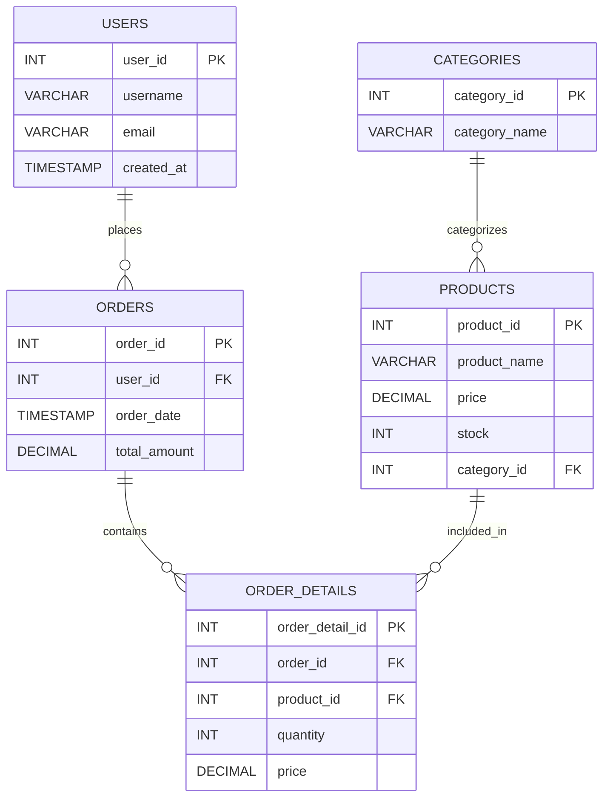

# E-COMMERCE FLASH SALE ENGINE (MINI PROJECT)

## Giới thiệu dự án
Hệ thống Xử lý Đơn hàng Flash Sale là một backend module tập trung vào tối ưu hóa JDBC, chống SQL Injection và kiểm soát **Transaction** để xử lý hàng ngàn giao dịch đồng thời mà không gây lỗi vượt quá số lượng kho (**Overselling**).

---

## Thành viên nhóm & Phân công nhiệm vụ

| STT | Vai trò | Nhiệm vụ chi tiết | File/Thành phần phụ trách |
| :--- | :--- | :--- | :--- |
| **01** | **Nhóm trưởng & Writer (Đặng Quốc Toàn)** | Thiết kế cấu trúc (Skeleton), viết Menu chính, **viết tài liệu hướng dẫn (README), giải thích logic Transaction.** | `MainApp.java`, `README.md`, Project Integration. |
| **02** | **DB Designer** | Vẽ sơ đồ ERD, viết script `schema.sql`. Code logic đọc file SQL từ Java để khởi tạo Table tự động bằng `Statement`. | `resources/schema.sql`, `config/DBConfig.java`. |
| **03** | **Infrastructure Eng.** | Xây dựng `DatabaseConnectionManager` (Singleton Pattern). Quản lý kết nối và xử lý ngoại lệ `SQLException` tập trung. | `utils/DatabaseConnectionManager.java`. |
| **04** | **Data Dev (Product)** | Xây dựng Entity/DAO cho Product & Category. Triển khai các thao tác CRUD và cập nhật số lượng tồn kho. | `Product.java`, `Category.java`, `ProductDAO.java`, `CategoryDAO.java`. |
| **05** | **Data Dev (User)** | Xây dựng Entity/DAO cho User. Triển khai phương thức tìm kiếm, xác thực và quản lý thông tin người dùng. | `User.java`, `UserDAO.java`. |
| **06** | **Transaction Spec.** | **(Trọng tâm)** Triển khai hàm `placeOrder` trong Service. Cấu hình `setAutoCommit(false)`, xử lý `commit/rollback`. | `service/OrderService.java`. |
| **07** | **Order Specialist** | Xây dựng Entity/DAO cho Order. Áp dụng `addBatch()` của `PreparedStatement` cho `OrderDetail` để tối ưu hiệu năng. | `Order.java`, `OrderDetail.java`, `OrderDetailDAO.java`. |
| **08** | **Reporting & SQL Eng.** | Viết Stored Procedures. **Tạo Entity Report và gọi thực thi qua CallableStatement để lấy dữ liệu báo cáo.** | `TopBuyerReport.java`, `CategoryRevenueReport.java`, `OrderDAO.java`. |
| **09** | **QA / Tester** | Viết script mô phỏng Multi-threading (50+ Threads) mua hàng đồng thời để kiểm tra lỗi Overselling và Lost Update. | `src/test/java/ConcurrencyTest.java`. |
| **10** | **Security & Optimizer** | Phòng chống SQL Injection, tối ưu hóa Index trong DB và tinh chỉnh Transaction Isolation Level (Serializable/Repeatable Read). | Database Indexing & Security Audit. |

---

## Cấu trúc thư mục (Project Structure)
```text
flash-sale-system/
│
├── src/
│   ├── main/
│   │   ├── java/
│   │   │   └── com/flashsale/
│   │   │       ├── entity/              # Entity (POJO) & Reports
│   │   │       │   ├── User.java
│   │   │       │   ├── Product.java
│   │   │       │   ├── Category.java
│   │   │       │   ├── Order.java
│   │   │       │   ├── OrderDetail.java
│   │   │       │   ├── TopBuyerReport.java           <-- New
│   │   │       │   └── CategoryRevenueReport.java    <-- New
│   │   │       │
│   │   │       ├── dao/                 # Tầng truy cập dữ liệu
│   │   │       │   ├── UserDAO.java
│   │   │       │   ├── ProductDAO.java
│   │   │       │   ├── OrderDAO.java    # Chứa logic Reporting
│   │   │       │   ├── OrderDetailDAO.java
│   │   │       │   └── CategoryDAO.java
│   │   │       │
│   │   │       ├── service/             # Logic nghiệp vụ (Transaction)
│   │   │       │   └── OrderService.java
│   │   │       │
│   │   │       ├── utils/               # Tiện ích kết nối (Singleton)
│   │   │       │   └── DatabaseConnectionManager.java
│   │   │       │
│   │   │       ├── config/              # Cấu hình Database
│   │   │       │   └── DBConfig.java
│   │   │       │
│   │   │       └── app/                 # Điểm chạy chương trình (Main)
│   │   │           └── MainApp.java
│   │
│   ├── resources/
│   │   └── schema.sql                   # Script khởi tạo cơ sở dữ liệu
```

### ERD Diagram

